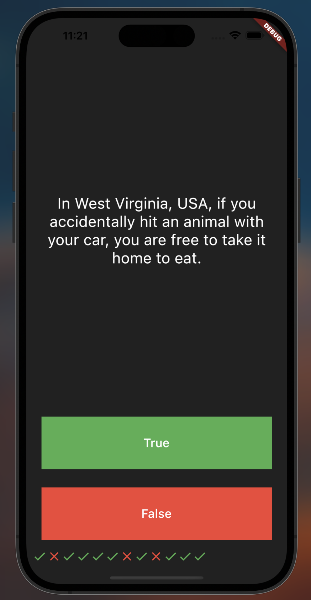

Quizzler Challenge Solution

This is a quiz app that tests general knowledge.  

In this project I learned:
- Dart classes and objects.
- Extracting Widgets to refactor code.
- private and public modifiers in Dart.
- How to use Dart lists.
- The difference between var, const, and final.

  
&nbsp; &nbsp; &nbsp; &nbsp;

